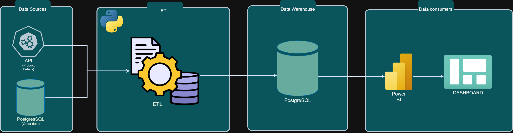
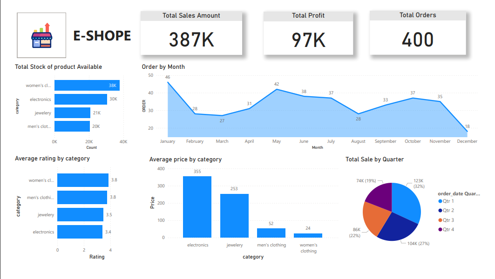

# End-to-End-Sales-Data-ETL-Pipeline-and-Visualization
[](https://www.python.org/)
[](https://www.postgresql.org/)
[](https://pandas.pydata.org/)
[](https://powerbi.microsoft.com/)
[](https://en.wikipedia.org/wiki/Extract,_transform,_load)
[](https://en.wikipedia.org/wiki/REST)
[](https://en.wikipedia.org/wiki/Data_visualization)
[](https://en.wikipedia.org/wiki/Data_analysis)
[](https://en.wikipedia.org/wiki/Automation)
[]()

## 🚀 Project Overview

This project showcases a streamlined ETL (Extract, Transform, Load) pipeline that integrates and visualizes sales data. The pipeline pulls data from two sources: a REST API and a PostgreSQL database. The data is then cleaned, processed, and transformed to be ready for analysis. After that, it's loaded into a PostgreSQL database. Finally, the data is displayed in an interactive Power BI dashboard, providing stakeholders with clear, actionable insights to support data-driven decision-making.

## Architecture 


## 🔑 Key Features

### 📊 Data Sources:
- **Sales product details** from a API. (https://fakestoreapi.com//products)
- **Order data** from a PostgreSQL database. (Order datA is generated using Faker in python and inserted into database)

### ⚙️ ETL Process:
1. **Extraction**: Fetching and querying data from the API and database.
2. **Transformation**: Cleaning, merging, and preparing data for analysis.
3. **Loading**: Inserting the transformed data into a PostgreSQL table.
4. **Visualization**: Power BI dashboard connected to the PostgreSQL database.
5. **Automation**: Modular design enables easy integration with automation tools like cron jobs.

### 🛠️ Tools and Technologies:
- **Programming Language**: Python
- **Libraries Used**:
  - `requests`: For API data extraction.
  - `pandas`: For data cleaning and transformation.
  - `psycopg2`: For interacting with the PostgreSQL database.
  - `Faker`: For generating order data.
- **Database**: PostgreSQL
- **Visualization Tool**: Power BI

## 🔄 ETL Pipeline Workflow

### Step 1: Extraction
#### 🌐 **API Extraction**:
- Extract product data from a API.
- The API returns nested JSON, which is flattened using Pandas.

#### 🗄️ **Database Extraction**:
- Query order data from PostgreSQL using SQL queries.
- Load the queried data into a Pandas DataFrame.

### Step 2: Transformation
#### 🧹 **Data Cleaning**:
- Standardize data formats for consistency.

#### 🔗 **Data Merging**:
- Merge API data and database data using the `product_id` field as the key.

#### 📊 **Final Transformation**:
- Prepare the merged data for analytical needs by aggregating key metrics.

### Step 3: Loading
- Insert the cleaned and merged data into a new table in the PostgreSQL database named `product_order`.

### Step 4: Logging and Error Handling
- Use Python's `logging` module to log progress and capture errors throughout the pipeline.

## 📈 Visualization: Power BI Dashboard

##  📷 Final Dashboard
 
### Key Metrics Displayed:
- **Total Sales Amount**: Aggregate sales revenue.
- **Total Profit**: Profit calculated from sales data.
- **Total Orders**: Number of orders processed.
- **Order Trends by Month**: Monthly breakdown of sales orders.
- **Category Insights**:
  - Total stock available.
  - Average rating by category.
  - Average price by category.
- **Sales by Quarter**: A pie chart showing sales distribution across quarters.

### Power BI Setup:
- Connect Power BI to the PostgreSQL database using the loaded table `product_order`.
- Create visuals to display business insights as shown in the final dashboard.

## 💡 Learnings FROM PROJECT

1. **End-to-End ETL Workflow**:  
   Gained experience in extracting, transforming, and loading data for business analysis. 🔄

2. **API Data Extraction**:  
   Learned how to fetch and flatten nested JSON data from REST APIs using `requests` and `pandas`. 🌐

3. **SQL & Database Interaction**:  
   Enhanced SQL skills by querying PostgreSQL and managing tables with `psycopg2`. 🗄️

4. **Data Transformation & Cleaning**:  
   Mastered data cleaning, handling missing values, and standardizing formats using `pandas`. 🧹

5. **Data Merging**:  
   Merged API and database data efficiently using common keys (e.g., `product_id`). 🔗

6. **Power BI Integration**:  
   Connected PostgreSQL to Power BI to create dynamic visualizations and business insights. 📊

7. **Project Documentation**:  
   Documented project setup and execution for easy sharing and future scalability. 📑

8. **Business Insights**:  
    Transformed sales data into actionable insights, like trends and category performance. 📈


## 📂 Project Directory Structure

```plaintext
sales_data_pipeline/
├──dashboard
│   ├──analysis_dashboard
├──destination_table
│   ├── creating_destination_table.py
├──order_data_generator
│   ├── inserting_fake_data_to_db.py
├── src/
│   ├── extraction/
│   │   ├── fetch_api.py
│   │   ├── fetch_db.py
│   ├── transformation/
│   │   ├── transform_api.py
│   │   ├── transform_db.py
│   │   ├── merge_data.py
│   ├── loading/
│   │   ├── load_to_db.py
│   ├── utils/
│   │   ├── config.py
│   │   ├── db_connection.py
│   │   ├── logging_setup.py
│   ├── etl_pipeline.py
```

